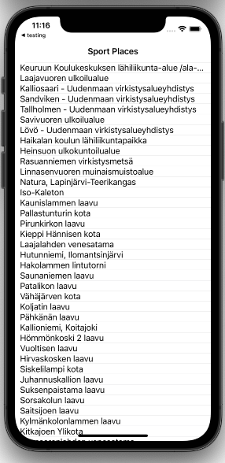
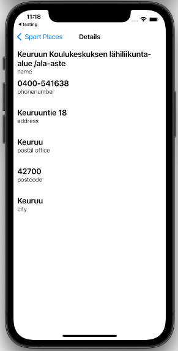

# LipasApp

iOS application build with swift using MVVM architecture and rxLibrary

App uses open API called lipas which contains sport places all around finland
see more (https://www.lipas.fi/etusivu) 






## Getting Started

### Usage 

Clone the repository: 
```
    git clone git@github.com:nikolip/LipasApp.git
```

Go to project root and install pods:
```
    pod install
```
    
You might need to change development team to run app.


## More Info

 - Targets
    - Test: Unit tests made with XCTest framework
    - UITest: Functional tests with XCTest framework (TODO!)
    - App: Lipas is open API so all calls will go to production
        - NOTE - lipas uses http-protocol not (https). App Transport security settings have been changed to allow Arbitary loads
        
- Pods
    - RxSwift
    - RxCocoa
    - Alamofire
    

## What next

### Next features?
    - List API call parameters
        - List parameters are hard coded and there is only one parameter included.
        - Lipas Api contains pretty nice ways to fetch certain types of sport places so that could be nice feature to add
    - Refresh
        - User has no way to load more or refresh list shown on main screen.

### Improvements

    - Tests doesn't fully cover app/code. They basicly templates for testing and can be continued from there
    - Error handling
        - Errors show hard coded strings which doesn't depend anything on error code enums.
        
